PAV - P2: detección de actividad vocal (VAD)
============================================

Esta práctica se distribuye a través del repositorio GitHub [Práctica 2](https://github.com/albino-pav/P2),
y una parte de su gestión se realizará mediante esta web de trabajo colaborativo.  Al contrario que Git,
GitHub se gestiona completamente desde un entorno gráfico bastante intuitivo. Además, está razonablemente
documentado, tanto internamente, mediante sus [Guías de GitHub](https://guides.github.com/), como
externamente, mediante infinidad de tutoriales, guías y vídeos disponibles gratuitamente en internet.


Inicialización del repositorio de la práctica.
----------------------------------------------

Para cargar los ficheros en su ordenador personal debe seguir los pasos siguientes:

*	Abra una cuenta GitHub para gestionar esta y el resto de prácticas del curso.
*	Cree un repositorio GitHub con el contenido inicial de la práctica (sólo debe hacerlo uno de los
	integrantes del grupo de laboratorio, cuya página GitHub actuará de repositorio central del grupo):
	-	Acceda la página de la [Práctica 2](https://github.com/albino-pav/P2).
	-	En la parte superior derecha encontrará el botón **`Fork`**. Apriételo y, después de unos segundos,
		se creará en su cuenta GitHub un proyecto con el mismo nombre (**P2**). Si ya tuviera uno con ese 
		nombre, se utilizará el nombre **P2-1**, y así sucesivamente.
*	Habilite al resto de miembros del grupo como *colaboradores* del proyecto; de este modo, podrán
	subir sus modificaciones al repositorio central:
	-	En la página principal del repositorio, en la pestaña **:gear:`Settings`**, escoja la opción 
		**Collaborators** y añada a su compañero de prácticas.
	-	Éste recibirá un email solicitándole confirmación. Una vez confirmado, tanto él como el
		propietario podrán gestionar el repositorio, por ejemplo: crear ramas en él o subir las
		modificaciones de su directorio local de trabajo al repositorio GitHub.
*	En la página principal del repositorio, localice el botón **Branch: master** y úselo para crear
	una rama nueva con los primeros apellidos de los integrantes del equipo de prácticas separados por
	guion (**fulano-mengano**).
*	Todos los miembros del grupo deben realizar su copia local en su ordenador personal.
	-	Copie la dirección de su copia del repositorio apretando en el botón **Clone or download**.
		Asegúrese de usar *Clone with HTTPS*.
	-	Abra una sesión de Bash en su ordenador personal y vaya al directorio **PAV**. Desde ahí, ejecute:

		```.sh
		git clone dirección-del-fork-de-la-práctica
		```

	-	Vaya al directorio de la práctica `cd P2`.
	-	Añada la etiqueta `origin` a su copia del repositorio. Esto es útil para facilitar los *push* y
		*pull* al repositorio original:
		```.sh
		git remote add origin dirección-del-fork-de-la-práctica
		```
	-	Cambie a la rama **fulano-mengano** con la orden:

		```.sh
		git checkout fulano-mengano
		```

*	A partir de este momento, todos los miembros del grupo de prácticas pueden trabajar en su directorio
	local del modo habitual.
	-	También puede utilizar el repositorio remoto como repositorio central para el trabajo colaborativo
		de los distintos miembros del grupo de prácticas; o puede serle útil usarlo como copia de
		seguridad.
	-	Cada vez que quiera subir sus cambios locales al repositorio GitHub deberá confirmar los
		cambios en su directorio local:

		```.sh
		git add .
		git commit -m "Mensaje del commit"
		```

		y, a continuación, subirlos con la orden:

		```.sh
		git push -u origin fulano-mengano
		```

*	Al final de la práctica, la rama **fulano-mengano** del repositorio GitHub servirá para remitir la
	práctica para su evaluación utilizando el mecanismo *pull request*.
	-	Vaya a la página principal de la copia del repositorio y asegúrese de estar en la rama
		**fulano-mengano**.
	-	Pulse en el botón **New pull request**, y siga las instrucciones de GitHub.


Entrega de la práctica.
-----------------------

Responda, en este mismo documento (README.md), los ejercicios indicados a continuación. Este documento es
un fichero de texto escrito con un formato denominado _**markdown**_. La principal característica de este
formato es que, manteniendo la legibilidad cuando se visualiza con herramientas en modo texto (`more`,
`less`, editores varios, ...), permite amplias posibilidades de visualización con formato en una amplia
gama de aplicaciones; muy notablemente, **GitHub**, **Doxygen** y **Facebook** (ciertamente, :eyes:).

En GitHub. cuando existe un fichero denominado README.md en el directorio raíz de un repositorio, se
interpreta y muestra al entrar en el repositorio.

Debe redactar las respuestas a los ejercicios usando Markdown. Puede encontrar información acerca de su
sintáxis en la página web [Sintaxis de Markdown](https://daringfireball.net/projects/markdown/syntax).
También puede consultar el documento adjunto [MARKDOWN.md](MARKDOWN.md), en el que se enumeran los
elementos más relevantes para completar la redacción de esta práctica.

Recuerde realizar el *pull request* una vez completada la práctica.

Ejercicios
----------

### Etiquetado manual de los segmentos de voz y silencio

- Etiquete manualmente los segmentos de voz y silencio del fichero grabado al efecto. Inserte, a 
  continuación, una captura de `wavesurfer` en la que se vea con claridad la señal temporal, el contorno de
  potencia y la tasa de cruces por cero, junto con el etiquetado manual de los segmentos.

	Esto ha de quedar *bonito*. El profa está insistiendo en que debe quedar bonito, vete tu a saber cómo quedará dado que a mi, personalmente, la estética me importa menos que una mierda. Lo siento ALbino. PD. ¿Contra quién juega el Madrid en Copa? 
  
	Si etiquetamos las partes de nuestra señal con etiquetas de silencios (S) y voz (V), nos queda lo siguiente:  
  


	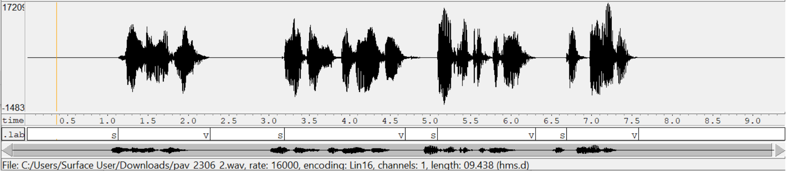
      
	Tras calcular la tasa de cruces por cero y la potencia (usando la implementación de ventana rectangular), finalmente, nos queda:

	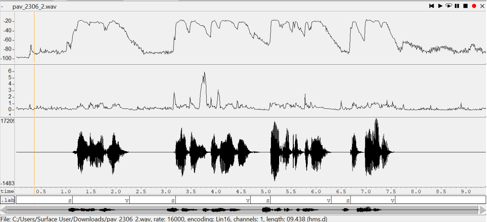

	##### ***Primera gráfica:*** *Contorno de la potencia;* ***Segunda gráfica:*** *ZCR*
- A la vista de la gráfica, indique qué valores considera adecuados para las magnitudes siguientes:

	* Incremento del nivel potencia en dB, respecto al nivel correspondiente al silencio inicial, para estar seguros de que un segmento de señal se corresponde con voz.
	
	Durante el silencio inicial tenemos unos *-100...-80 dB*, que pasan a -20 dB una vez empieza un tramo de voz, con lo que **un incremento de 20-40dB** podría ser razonable.
	
	* Duración mínima razonable de los segmentos de voz y silencio.

	Los segmentos de voz, obviando las palabras cortas que solemos pronunciar juntas, suelen durar **ligeramente más de 0.5s.**

	* ¿Es capaz de sacar alguna conclusión a partir de la evolución de la tasa de cruces por cero?

	La tasa de cruces por cero aumenta en tramos de voz. Por un lado, aumenta ligeramente cuando se están pronunciando sonidos sonoros. Por otro lado, cuando pronunciamos sonidos sordos, en algunos se dispara. Esto nos puede ser útil de cara a detectar si es un tramo de voz o silencio, ya que en los tramos sordos la potencia es muy parecida a la de los tramos de silencio, sin embargo, el zcr aumenta bastante.

### Desarrollo del detector de actividad vocal

- Complete el código de los ficheros de la práctica para implementar un detector de actividad vocal tan
  exacto como sea posible. Tome como objetivo la maximización de la puntuación-F `TOTAL`.

- Inserte una gráfica en la que se vea con claridad la señal temporal, el etiquetado manual y la detección
  automática conseguida para el fichero grabado al efecto. 

	En un estado temprano del detector de actividad vocal, se obtiene lo siguiente:

	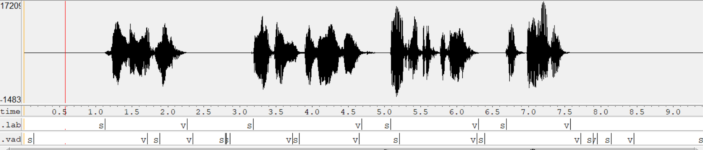

	##### *En la parte inferior se puede ver el etiquetado generado por el vad (.vad), justo debajo del que hemos hecho "a mano" (.lab)*

	Después de haber mejorado el criterio de detección, obtenemos:

	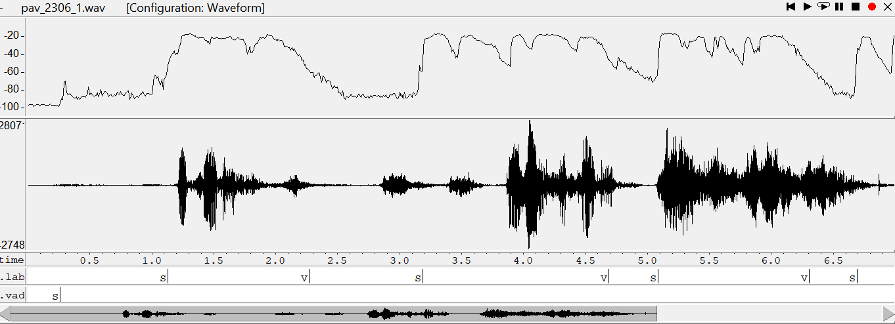

	##### *Vemos como detectamos toda la señal como voz al haber una variación repentina de potencia al principio*

	Esto nos ha hecho ver uno de los fallos de nuestra implementación: deberíamos haber tenido en cuenta posiblemente un promedio de más ventanas, ya que el nivel de potencia puede dar variaciones en casos inesperados cuando se empieza un audio.

	Aún así, en los casos donde no se produce esto tenemos bastantes mejores resultados que el caso aleatorio:

	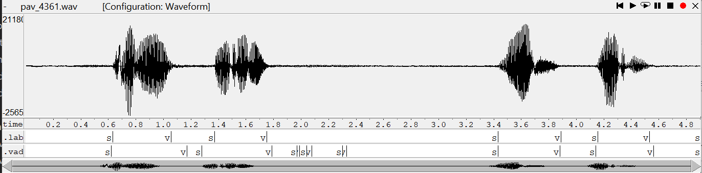

	##### *Resultados obtenidos usando pav_4361 (2018-2019q1)*

- Explique, si existen. las discrepancias entre el etiquetado manual y la detección automática.

	Tal como se puede ver, los resultados no se asemejan demasiado. En el momento de la captura nuestro vad funcionaba considerando voz si la potencia superaba un threshold concreto (0.9) y silencio en el caso contrario. Al no haber implementado aún el cálculo de la potencia que hicimos en la práctica anterior, la obtención de la potencia se hacía con números aleatorios, lo cual hace que los resultados no tengan mucho a ver con la realidad.
	Al implementarlo con resultados de la potencia no aleatorios, hemos conseguido una mejora bastante grande, pero sigue teniendo algunos problemas. Se pueden dar transiciones repentinas, las cuales no tienen mucho sentido ya que los tramos de voz y silencio suelen tener una duración relativamente alta, y además, nuestra evaluación depende demasiado del nivel de potencia, el cual nos puede causar equivocaciones vad_data->frame_length = rate * FRAME_TIME * 1e-3; en casos concretos.


- Evalúe los resultados sobre la base de datos `db.v4` con el script `vad_evaluation.pl` e inserte a 
  continuación las tasas de sensibilidad (*recall*) y precisión para el conjunto de la base de datos (sólo
  el resumen).

	Las tasas finales obtenidas han sido:

	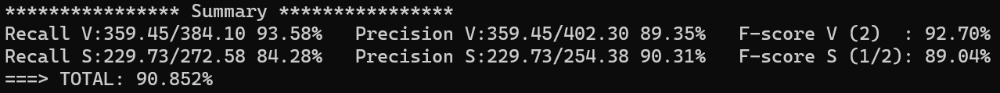	

### Trabajos de ampliación

#### Cancelación del ruido en los segmentos de silencio

- Si ha desarrollado el algoritmo para la cancelación de los segmentos de silencio, inserte una gráfica en
  la que se vea con claridad la señal antes y después de la cancelación (puede que `wavesurfer` no sea la
  mejor opción para esto, ya que no es capaz de visualizar varias señales al mismo tiempo).

  Los resultados obtenidos al hacer que nuestro programa cancele los silencios son los siguientes:

	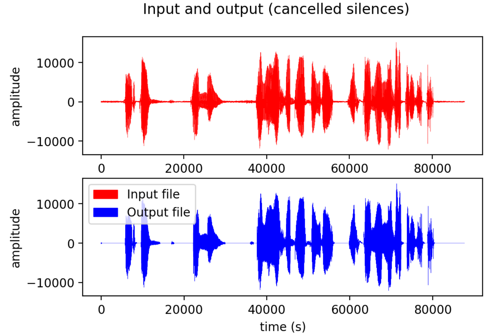
	
	##### *Gráfica realizada con nuestro script `plot_in_vs_out.py`*

	Esta representación nos ayuda a ver con claridad alguno de los fallos que comete nuestro programa: algunos segmentos sordos los identifica como silencio y cuando el ruido de fondo tiene un pequeño aumento de potencia, si pasa del threshold se considera voz.

#### Gestión de las opciones del programa usando `docopt_c`

- Si ha usado `docopt_c` para realizar la gestión de las opciones y argumentos del programa `vad`, inserte
  una captura de pantalla en la que se vea el mensaje de ayuda del programa.

	Nuestro programa tiene los argumentos siguientes:

	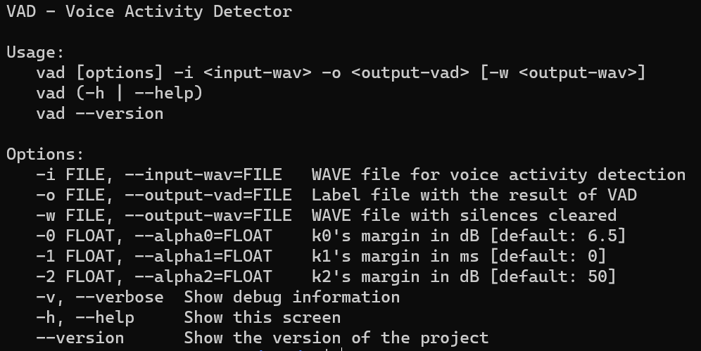

### Contribuciones adicionales y/o comentarios acerca de la práctica

- Indique a continuación si ha realizado algún tipo de aportación suplementaria (algoritmos de detección o 
  parámetros alternativos, etc.).

- ### Optimización de los parámetros y scripts usados para ello

	* Una de las tareas a realizar ha sido encontrar los parámetros que optimizaban nuestro programa (principalmenete `k0`). Para ello, hemos hecho un script de shell que calculara la puntuación total que se obtenía en `run_vad.sh`, solo que además, iterara sobre esta variando el parámetro de interés cada vez. El código completo de este se puede encontrar en `opt_vad.sh`. Este script permite iterar con variables que poseen un offset y permite saltos que no sean enteros (`div` controla cómo varía el índice. En este ejemplo va de 0.5 en 0.5, ya que `div=2`). Las variables clave son las siguientes:
	
	```bash
	lower_index_bound=0                     #lower bound of the for loop
	upper_index_bound=30                    #upper bound of the for loop
	offset=4                                #offset of the variable we want to iterate
	div=2                                   #controls the step size of the variable when we iterate it (=2 -> /2)
	```
	
	* Para facilitar la visualización de los resultados al iterar, hemos creado un script alternativo a `vad_evaluation.pl`  (`vad_evaluation_printless.pl`). Este es el mismo script pero con solo el print que nos indica el % TOTAL y imprime esta variable en un fichero `out_alpha.txt` (también usado en `opt_vad.sh`). Las líneas de código más significativas que hemos añadido en este fichero auxiliar son las siguientes:

	```perl
	open(FH, '>>', $outfile);	#open the file (append)
    printf "===> %s: %.3f%%\n", $filename, ($F_V * $F_S) ** (1. / 2.);	#display result on screen
	printf FH "%.3f\n", ($F_V * $F_S) ** (1. / 2.);	#print total value into the file
	close(FH);
	```
	
	A continuación, podemos ver la evolución de k0 según se va iterando:
	
	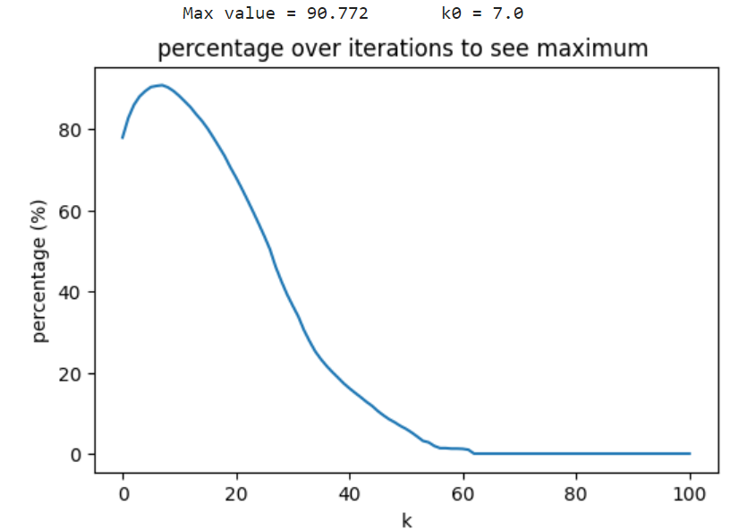	

	##### *`lower_index_bound = 0, upper_index_bound = 100, offset = 0, div = 1`*

	Hecho este primer barrido, hemos visto que el valor óptimo para `k0` se encontraba aproximadamente en valores inferiores a 10, así que hemos hecho un segundo barrido con saltos más pequeños (`div=10` -> saltos de 0.1):

	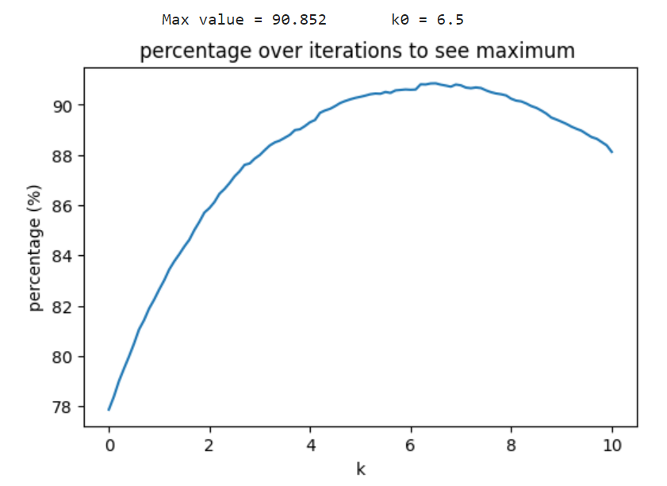	

	##### *`lower_index_bound = 0, upper_index_bound = 100, offset = 0, div = 10`*

	A partir de estos resultados, hemos decidido escoger el valor `k0 = 6.5`

	De manera análoga, hemos optimizado el tiempo de duración de frame, aunque este no se ha acabado de estabilizar en un punto concreto:

	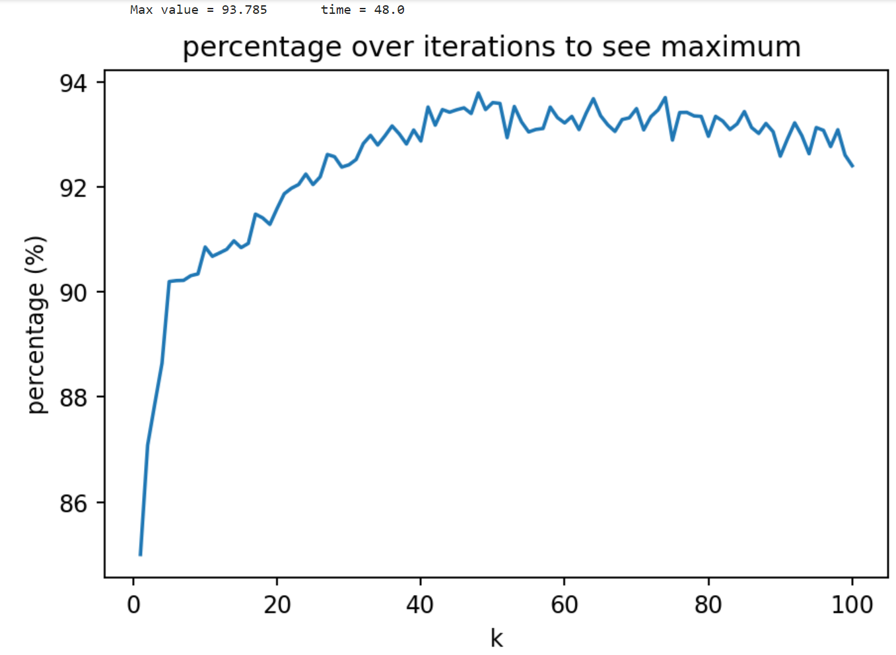

	##### *`lower_index_bound = 0, upper_index_bound = 100, offset = 0, div = 1`*

	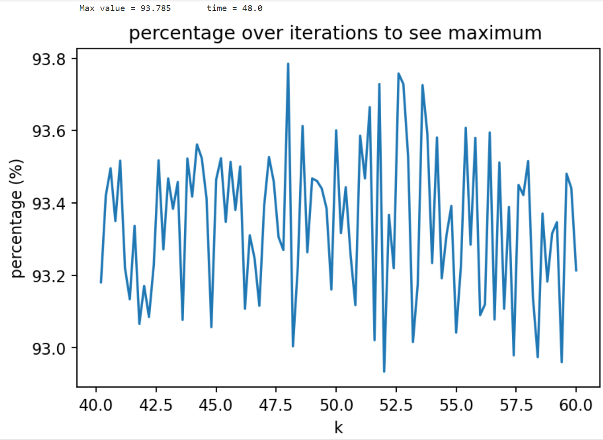

	##### *`lower_index_bound = 0, upper_index_bound = 100, offset = 40, div = 5`*
	
- Si lo desea, puede realizar también algún comentario acerca de la realización de la práctica que
  considere de interés de cara a su evaluación.

  Se ha intentado implementar el hecho de considerar un cambio de segmento si pasaba un tiempo especificado (`alpha1`). Aún así, no hemos logrado mejorar la detección con este, así que lo hemos puesto por defecto a 0 y lo hemos mantenido en el programa por si se quisiesen hacer pruebas con éste o mejorar la implementación para ver si se pueden mejorar los resultados. También se ha incluido un parámetro análogo a `alpha0` pero para el zcr (`alpha2`). Es una implementación bastante parecida a la que hemos hecho para la potencia.


### Antes de entregar la práctica

Recuerde comprobar que el repositorio cuenta con los códigos correctos y en condiciones de ser 
correctamente compilados con la orden `meson bin; ninja -C bin`. El programa generado (`bin/vad`) será
el usado, sin más opciones, para realizar la evaluación *ciega* del sistema.
